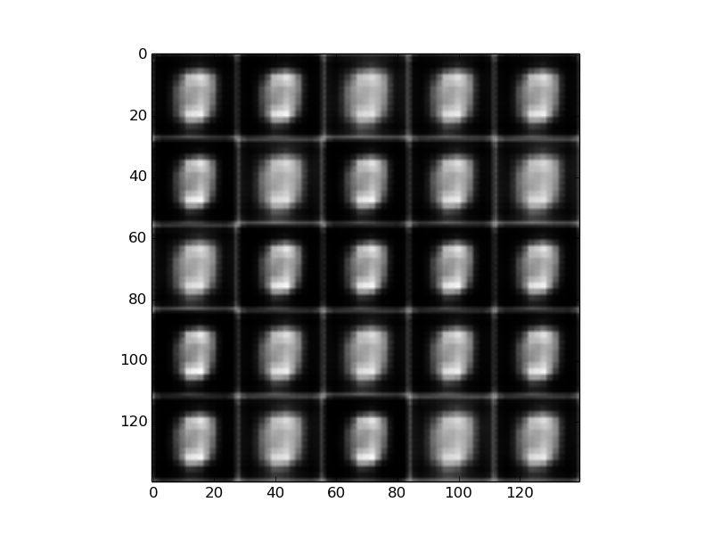
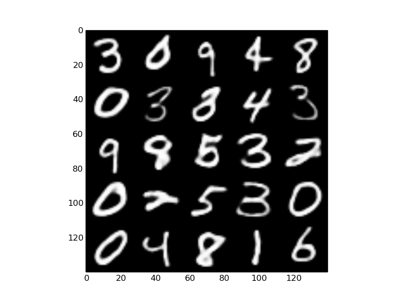
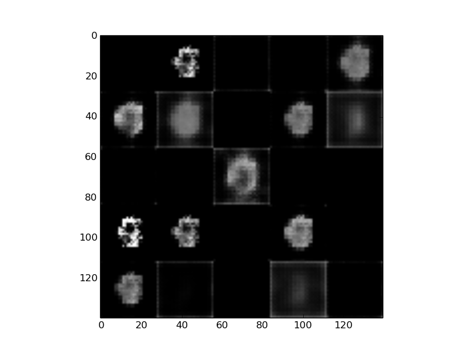
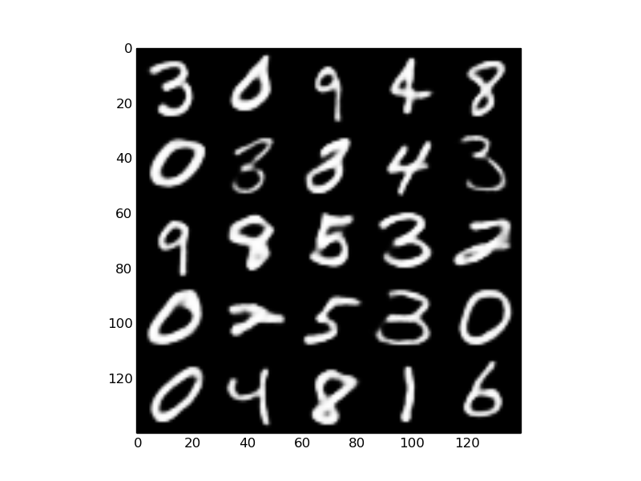
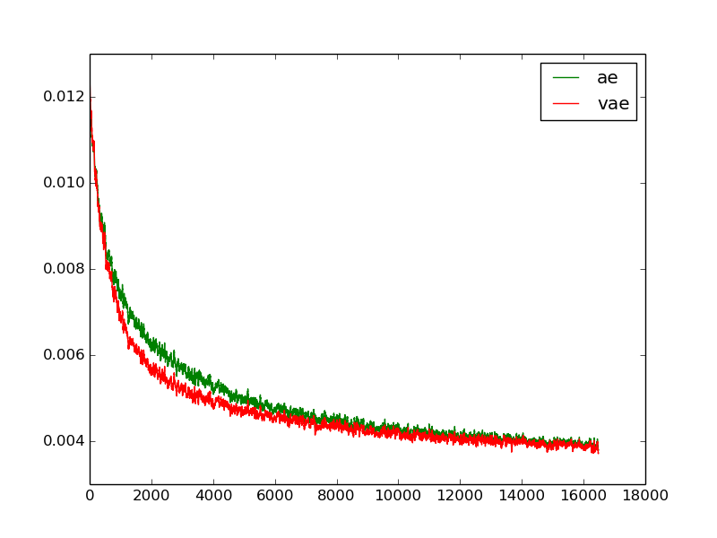

# (Variational) Auto-Encoder on MNIST

An implemention of normal Auto-Encoder, and Variational Auto-Encoder(VAE) on MNIST, written in Tensorflow.

# Results

## Reconstruction results

| *Network* | *Input* | *Reconstruct epoch0* | *Reconstruct epoch500* |
| :---: | :---: | :---: | :---: |
| *AE* |  |  |  | 
| *VAE* |  |  |  | 

## MSE comparision

<div align="center">

</div>

# Usage

Train an AE and an VAE.
Change embedding dimension in `main.py`.

```python
python main.py
```

# Reference

This implementation is based on projects:

[hwalsuklee/tensorflow-mnist-VAE](https://github.com/hwalsuklee/tensorflow-mnist-VAE)